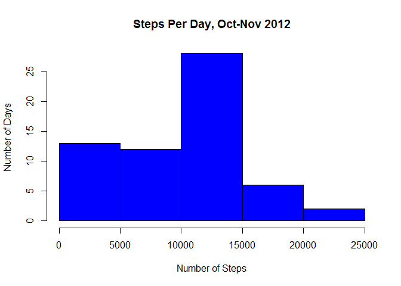
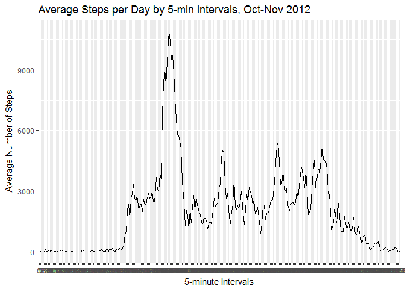
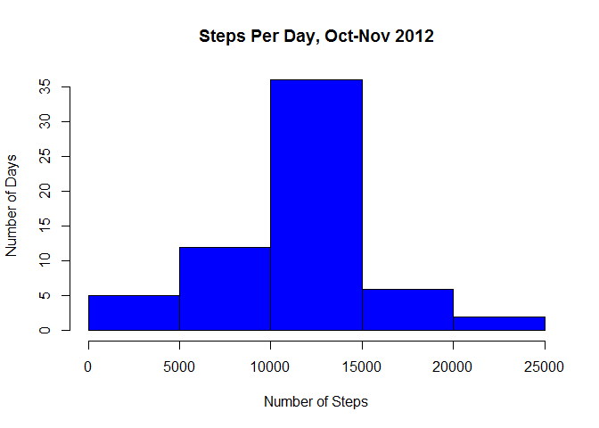
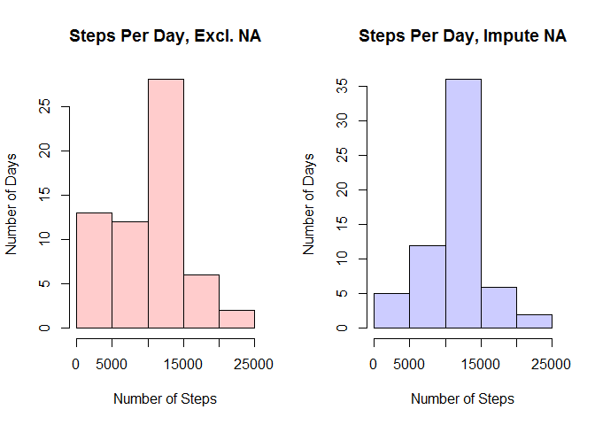
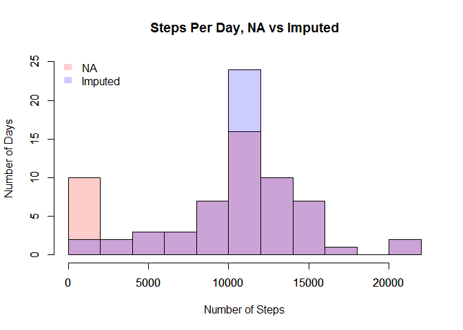

# Developing Data products Course Project 1
Juan Tenopala  
19 de marzo de 2017  

# Assignment.
This assignment will be described in multiple parts. You will need to write a report that answers the questions detailed below. Ultimately, you will need to complete the entire assignment in a single R markdown document that can be processed by knitr and be transformed into an HTML file.

Throughout your report make sure you always include the code that you used to generate the output you present. When writing code chunks in the R markdown document, always use echo = TRUE so that someone else will be able to read the code. This assignment will be evaluated via peer assessment so it is essential that your peer evaluators be able to review the code for your analysis.

For the plotting aspects of this assignment, feel free to use any plotting system in R (i.e., base, lattice, ggplot2)

Fork/clone the GitHub repository created for this assignment. You will submit this assignment by pushing your completed files into your forked repository on GitHub. The assignment submission will consist of the URL to your GitHub repository and the SHA-1 commit ID for your repository state.

NOTE: The GitHub repository also contains the dataset for the assignment so you do not have to download the data separately.

##Loading and preprocessing the data.

```r
activity <- read.csv("activity.csv")
activity$date <- as.Date(activity$date)
activity$interval <- as.factor(activity$interval)
```

##What is mean total number of steps taken per day?
###Make a histogram of the total number of steps taken each day.

```r
library(plyr)
```

```
## Warning: package 'plyr' was built under R version 3.2.5
```

```r
steps_per_day <- ddply(activity, .(date), summarise, sum = sum(steps, na.rm=T))
hist(steps_per_day$sum, ylab="Number of Days", col="blue", xlab="Number of Steps", main="Steps Per Day, Oct-Nov 2012")
```

<!-- -->

###Calculate and report the mean of the total number of steps taken per day.

```r
mean(steps_per_day$sum)
```

```
## [1] 9354.23
```
###Calculate and report the median of the total number of steps taken per day.

```r
median(steps_per_day$sum)
```

```
## [1] 10395
```

##What is the average daily activity pattern?
###Make a time series plot.

```r
library(ggplot2)
```

```
## Warning: package 'ggplot2' was built under R version 3.2.5
```

```r
steps_per_interval <- ddply(activity, .(interval), summarise, sum = sum(steps, na.rm=T))
p <- ggplot(steps_per_interval, aes(x=interval, y=sum, group=1)) 
p + geom_line() + labs(title = "Average Steps per Day by 5-min Intervals, Oct-Nov 2012") + labs(x = "5-minute Intervals", y = "Average Number of Steps")
```

<!-- -->

###Which 5-minute interval, on average across all the days in the dataset, contains the maximum number of steps?

```r
steps_per_interval[ which(steps_per_interval$sum==(max(steps_per_interval$sum))), ]
```

```
##     interval   sum
## 104      835 10927
```

##Imputing missing values.

```r
NA_values <- activity[!complete.cases(activity),]
nrow(NA_values)
```

```
## [1] 2304
```
###Calculate and report the total number of missing values in the dataset.

```r
NA_values <- activity[!complete.cases(activity),]
nrow(NA_values)
```

```
## [1] 2304
```
###Devise a strategy for filling in all of the missing values in the dataset.

```r
interval_mean <- ddply(activity, .(interval), summarise, mean = mean(steps, na.rm=T))
activity_with_interval_mean <- join(activity, interval_mean)
```

```
## Joining by: interval
```

```r
replace_NA <- function(dataset, variable, replacement) {
    for (i in 1:nrow(dataset)) {
        if (is.na(dataset[i, variable])) {
                dataset[i, variable] <- dataset[i, replacement]
        }
    }
    dataset
}
```
###Create a new dataset that is equal to the original dataset but with the missing data filled in.

```r
complete_activity <- replace_NA(activity_with_interval_mean, variable=1, replacement=4)
complete_activity <- complete_activity[, -4]
head(complete_activity)
```

```
##       steps       date interval
## 1 1.7169811 2012-10-01        0
## 2 0.3396226 2012-10-01        5
## 3 0.1320755 2012-10-01       10
## 4 0.1509434 2012-10-01       15
## 5 0.0754717 2012-10-01       20
## 6 2.0943396 2012-10-01       25
```
###Make a histogram of the total number of steps taken each day and Calculate and report the mean and median total number of steps taken per day.

```r
complete_steps_per_day <- ddply(complete_activity, .(date), summarise, sum = sum(steps))
complete_steps_per_day$sum <- round(complete_steps_per_day$sum)
hist(complete_steps_per_day$sum, ylab="Number of Days", col="blue", xlab="Number of Steps", main="Steps Per Day, Oct-Nov 2012")
```

<!-- -->

###Do these values differ from the estimates from the first part of the assignment?
Mean comparison

```r
mean(steps_per_day$sum)-mean(complete_steps_per_day$sum)
```

```
## [1] -1411.934
```
As you can see the result is different from zero, therefore the values differ

Mean comparison

```r
median(steps_per_day$sum)-median(complete_steps_per_day$sum)
```

```
## [1] -371
```
As you can see the result is different from zero, therefore the values differ

###What is the impact of imputing missing data on the estimates of the total daily number of steps?
Separate histograms

```r
par(mfrow=c(1,2)) 
hist(steps_per_day$sum, ylab="Number of Days", col=rgb(1,0,0,0.2), xlab="Number of Steps", main="Steps Per Day, Excl. NA")
hist(complete_steps_per_day$sum, ylab="Number of Days", col=rgb(0,0,1,0.2), xlab="Number of Steps", main="Steps Per Day, Impute NA")
```

<!-- -->

Overlapping histograms

```r
hist(steps_per_day$sum,ylim=c(0,25),breaks=10,col=rgb(1,0,0,0.2), ylab="Number of Days", xlab="Number of Steps", main="Steps Per Day, NA vs Imputed")
par(new=TRUE)
hist(complete_steps_per_day$sum,ylim=c(0,25),breaks=10,col=rgb(0,0,1,0.2),main="",xlab="",ylab="")
legend('topleft',c('NA','Imputed'),
       fill = c(rgb(1,0,0,0.2), rgb(0,0,1,0.2)), bty = 'n',
       border = NA)
```

<!-- -->

##Are there differences in activity patterns between weekdays and weekends?
###Create a new factor variable in the dataset with two levels -- "weekday" and "weekend" indicating whether a given date is a weekday or weekend day.

```r
library(timeDate)
```

```
## Warning: package 'timeDate' was built under R version 3.2.5
```

```r
complete_activity$day_of_week <- ifelse(isWeekday(complete_steps_per_day$date)==TRUE, "weekday", "weekend")
```
###Make a panel plot containing a time series plot of the 5-minute interval (x-axis) and the average number of steps taken, averaged across all weekday days or weekend days (y-axis).

```r
library(lattice)
```

```
## Warning: package 'lattice' was built under R version 3.2.5
```

```r
xyplot(steps ~ interval | day_of_week, layout = c(1, 2), data=complete_activity, type="l")
```

<!-- -->
